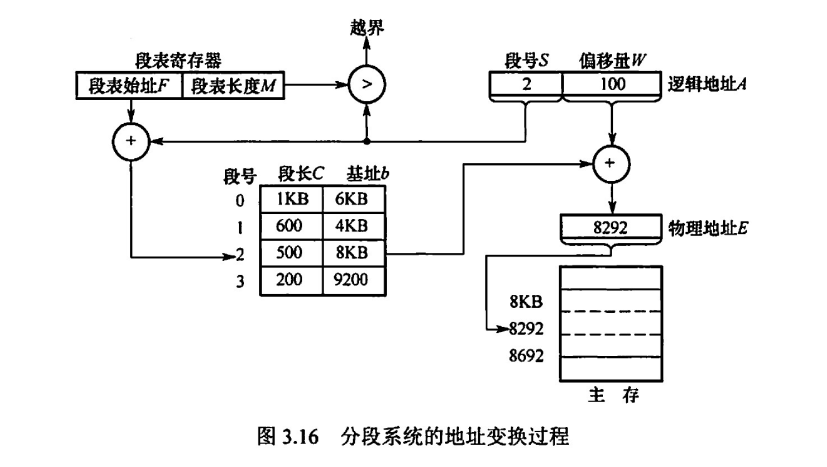
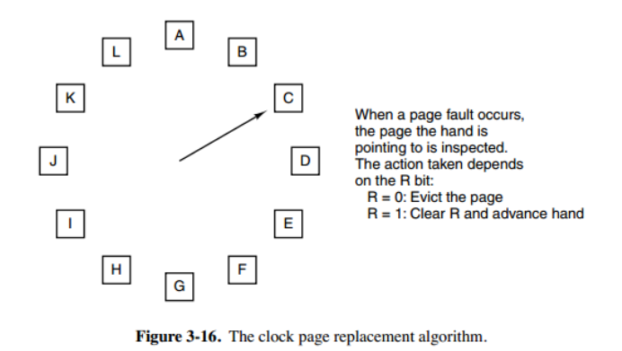

# 内存管理

## 目录

- [1. 内存分配管理方式](#1-内存分配管理方式)
  - [1.1 连续分配管理方式](#11-连续分配管理方式)
  - [1.2 分页存储管理](#12-分页存储管理)
    - [1.2.1 基本概念](#121-基本概念)
    - [1.2.2 地址结构](#122-地址结构)
    - [1.2.3 地址变换过程](#123-地址变换过程)
    - [1.2.4 多级页表](#124-多级页表)
  - [1.3 分段存储](#13-分段存储)
    - [1.3.1 地址结构](#131-地址结构)
    - [1.3.2 地址变换过程](#132-地址变换过程)
  - [1.4 段页式管理](#14-段页式管理)
    - [1.4.1 地址结构](#141-地址结构)
    - [1.4.2 地址变换过程](#142-地址变换过程)
- [2. 页面置换算法](#2-页面置换算法)

# 1. 内存分配管理方式

## 1.1 连续分配管理方式

- **单一连续分配**

  内存分为系统区和用户区，系统区仅供操作系统使用；用户区的内存中，只有一道用户程序独占。
- **固定分区分配**

  将用户区划分为若干固定大小的区域，每个分区只装入一个作业

  无外部碎片，有内部碎片
- **动态分区分配**

  无内部碎片，有外部碎片

  动态分区的分配策略有以下几种：
  - 首次适应
  - 邻近适应
  - 最佳适应
  - 最坏适应

## 1.2 分页存储管理

### 1.2.1 基本概念

进程中的块称为页或者页面

内存中的块称为页框或者页帧

进程执行时需要为进程中的每个页分配内存的页框，这样就产生了页和页框的对应关系。

### 1.2.2 地址结构

逻辑地址结构包含：页号+页内偏移地址

页表用于记录进程的各个页面对应的物理块，包含：页号+块号

### 1.2.3 地址变换过程

### 1.2.4 多级页表

如下图：

## 1.3 分段存储

分段式管理方式按照用户进程中的自然段划分逻辑空间。

### 1.3.1 地址结构

逻辑地址结构为：段号+段内偏移量

段表的结构为：段号+段长+本段在主存的始址

### 1.3.2 地址变换过程

## 1.4 段页式管理

程序的地址空间划分成多个拥有独立地址空间的段，每个段上的地址空间划分成大小相同的页。这样既拥有分段系统的共享和保护，又拥有分页系统的虚拟内存功能。

### 1.4.1 地址结构

逻辑地址结构为：段号+页号+页内偏移量

### 1.4.2 地址变换过程

# 2. 页面置换算法

- 最佳置换算法（OPT）

  淘汰以后永不使用的页面，或者式在最长时间内不在被访问的页面。这是一种理想的算法
- 先进先出算法（FIFO）
- 最近最久未使用算法（LRU）
- 时钟置换算法（CLOCK）

  
