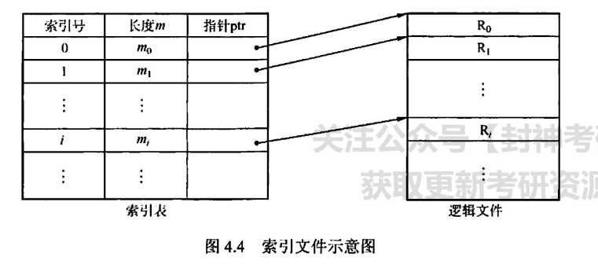
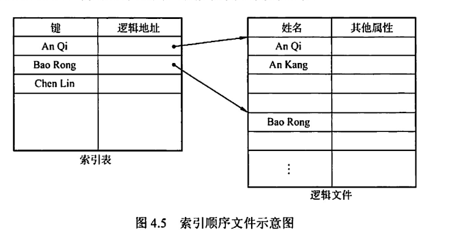
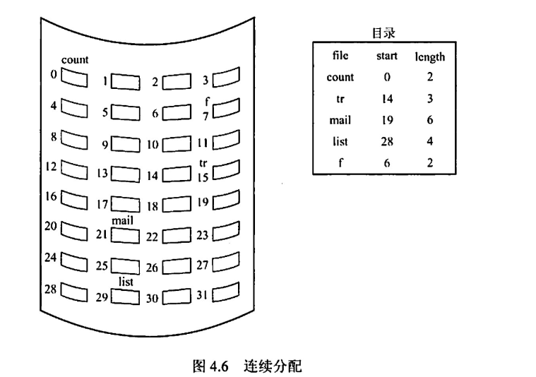
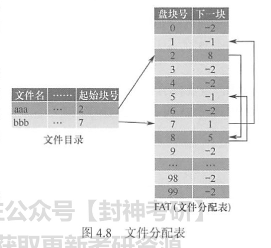
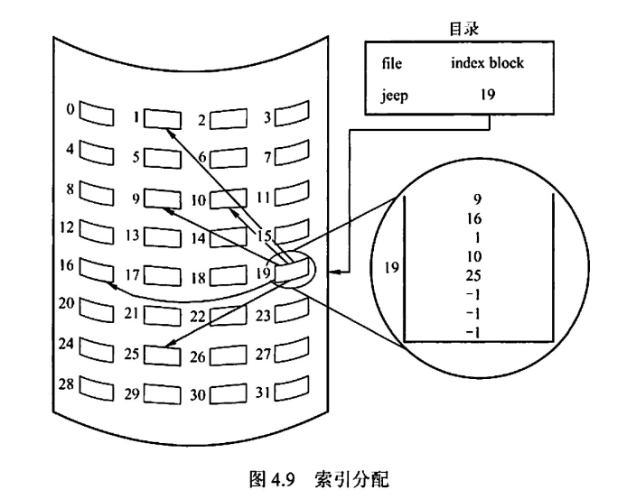
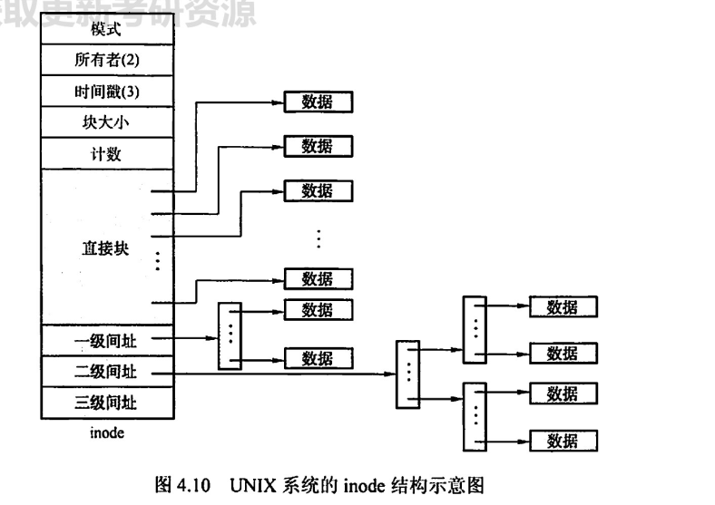
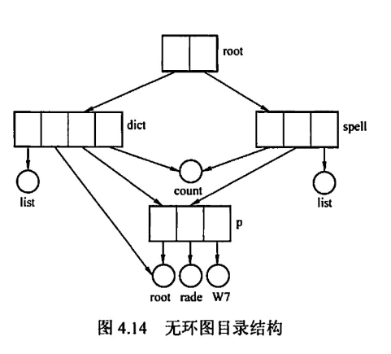
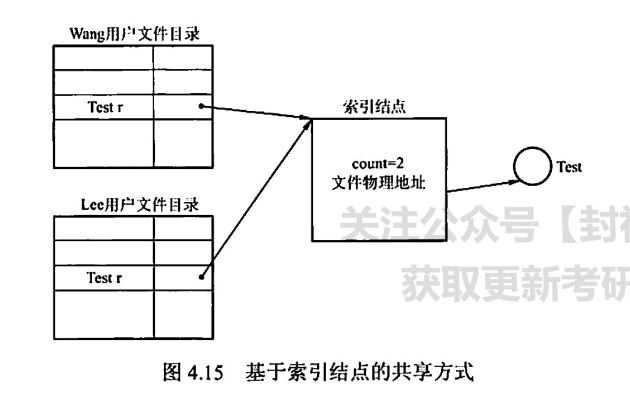
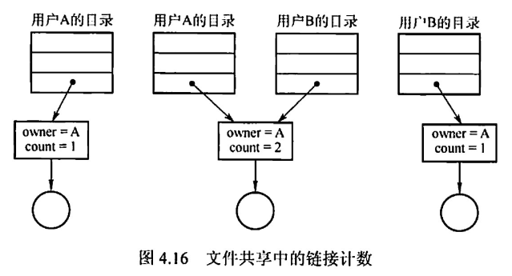
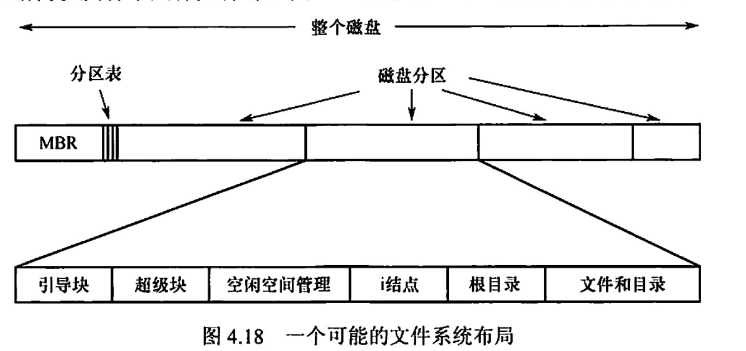

# 文件管理

## 目录

- [1. 概念](#1-概念)
- [2. 文件逻辑结构](#2-文件逻辑结构)
  - [2.1 无结构文件（流式文件）](#21-无结构文件流式文件)
  - [2.2 有结构文件（记录式文件）](#22-有结构文件记录式文件)
- [3. 文件物理结构](#3-文件物理结构)
  - [3.1 连续分配](#31-连续分配)
  - [3.2 链接分配](#32-链接分配)
  - [3.3 索引分配](#33-索引分配)
  - [3.4 混合索引分配](#34-混合索引分配)
- [4. 目录](#4-目录)
  - [4.1 目录结构](#41-目录结构)
  - [4.2 文件共享](#42-文件共享)
    - [4.2.1 基于索引节点的共享方式（硬链接）](#421-基于索引节点的共享方式硬链接)
    - [4.2.2 文件共享的链接计数](#422-文件共享的链接计数)
    - [4.2.3 符号链接实现文件共享（软链接）](#423-符号链接实现文件共享软链接)
- [5. 文件系统](#5-文件系统)
  - [5.1 文件系统在磁盘的结构](#51-文件系统在磁盘的结构)
    - [5.1.1 主引导记录](#511-主引导记录)
    - [5.1.2 引导块](#512-引导块)
    - [5.1.3超级块](#513超级块)

# 1. 概念

操作系统通过文件控制块（FCB）来维护文件元数据

索引节点记录了文件的信息和物理地址，文件目录中每个目录项由文件名和指向该索引节点的指针构成。

# 2. 文件逻辑结构

## 2.1 无结构文件（流式文件）

将数据按顺序组织成记录并积累保存。

对记录的访问只能通过穷举搜索方式

## 2.2 有结构文件（记录式文件）

- 顺序文件
- 索引文件

  
- 索引顺序文件

  

# 3. 文件物理结构

## 3.1 连续分配

每个文件在磁盘上占有一组连续的块。

优点：实现简单，存取速度块。

缺点：文件长度不宜动态增加。

## 3.2 链接分配

- 隐式链接

  目录中含有文件第一块的指针和最后一块的指针。

  
- 显示链接

  目录中含有文件的起始块号，并有一个FAT（文件分配表）存储的是每个盘块号指向的下一块地址。

  

## 3.3 索引分配

将每个文件的所有盘块号都集中放在一个块上构成索引块。

## 3.4 混合索引分配

# 4. 目录

## 4.1 目录结构

- 单级目录结构
- 两级目录结构
- 树形目录结构
- 无环图目录结构

  

## 4.2 文件共享

### 4.2.1 基于索引节点的共享方式（硬链接）

当有多个用户要共享一个文件时，必须将共享文件链接到多个用户的目录。

### 4.2.2 文件共享的链接计数

### 4.2.3 符号链接实现文件共享（软链接）

创建一个Link类型的文件指向共享的文件。

# 5. 文件系统

## 5.1 文件系统在磁盘的结构

文件系统存放在磁盘上，磁盘划分为一个或多个分区，每个分区有一个独立的文件系统。

### 5.1.1 主引导记录

主引导记录(Master BootRecord，MBR)，位于磁盘的0号扇区，用来引导计算机，MBR后面是分区表，该表给出每个分区的起始和结束地址。表中的一个分区被标记为活动分区，当计算机启动时，BIOS读入并执行 MBR。MBR做的第一件事是确定活动分区，读入它的第一块，即引导块。

### 5.1.2 引导块

该程序负责启动该分区中的操作系统。每个分区都从一个引导块开始，即使它不含有一个可启动的操作系统。

### 5.1.3超级块

超级块(super block)，包含文件系统的所有关键信息，在计算机启动时，或者在该文件系统首次使用时，超级块会被载入内存。超级块中的典型信息包括分区的块的数量、块的大小、空闲块的数量和指针、空闲的 FCB 数量和 FCB 指针等。
