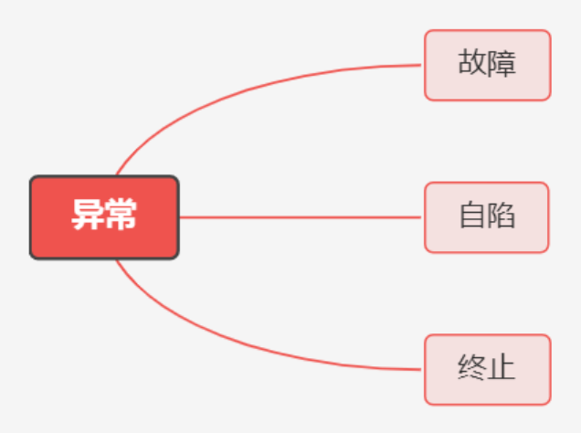

# 概述

# 1. 基本特征

## 1.1 并发

并发是指宏观上在一段时间内能同时运行多个程序，而并行则指同一时刻能运行多个指令。

并行需要硬件支持，如多流水线、多核处理器或者分布式计算系统。

操作系统通过引入进程和线程，使得程序能够并发运行。

## 1.2 共享

共享是指系统中的资源可以被多个并发进程共同使用。

有两种共享方式：互斥共享和同时共享。

互斥共享的资源称为临界资源，例如打印机等，在同一时刻只允许一个进程访问，需要用同步机制来实现互斥访问。

## 1.3 虚拟

虚拟技术把一个物理实体转换为多个逻辑实体。

主要有两种虚拟技术：时（时间）分复用技术和空（空间）分复用技术。

多个进程能在同一个处理器上并发执行使用了时分复用技术，让每个进程轮流占用处理器，每次只执行一小个时间片并快速切换。

虚拟内存使用了空分复用技术，它将物理内存抽象为地址空间，每个进程都有各自的地址空间。地址空间的页被映射到物理内存，地址空间的页并不需要全部在物理内存中，当使用到一个没有在物理内存的页时，执行页面置换算法，将该页置换到内存中。

## 1.4 异步

异步指进程不是一次性执行完毕，而是走走停停，以不可知的速度向前推进。

**同步和异步的区别**：

同步：事件、操作或进程是**有序的**，一个操作必须在另一个操作完成后开始执行。

异步：事件、操作或进程是**独立的**，可以在不等待其他操作完成的情况下开始执行。

# 2. 系统调用

如果一个进程在用户态需要使用内核态的功能，就进行系统调用从而陷入内核，由操作系统代为完成。

# 3. 宏内核和微内核

## 3.1 宏内核

宏内核是将操作系统功能作为一个紧密结合的整体放到内核。

由于各模块共享信息，因此有很高的性能。

## 3.2 微内核

由于操作系统不断复杂，因此将一部分操作系统功能移出内核，从而降低内核的复杂性。移出的部分根据分层的原则划分成若干服务，相互独立。

在微内核结构下，操作系统被划分成小的、定义良好的模块，只有微内核这一个模块运行在内核态，其余模块运行在用户态。

因为需要频繁地在用户态和核心态之间进行切换，所以会有一定的性能损失。

# 4. 中断和异常

中断和异常是操作系统由用户态进入核心态的途径

中断称为外中断，是指来自CPU执行指令外部的事件，如设备发出的I/O结束中断；时钟中断。

异常称为内中断，是指来自CPU执行指令内部事件，如程序地址越界，程序的非法操作码。异常不能被屏蔽。

