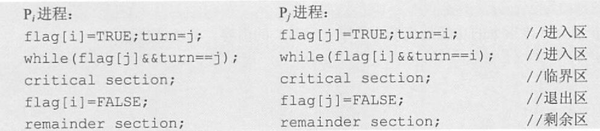
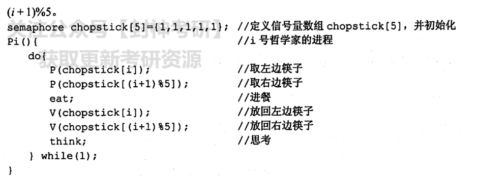
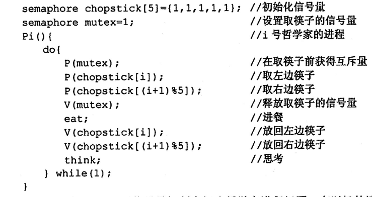

# 进程与线程

## 目录

- [1. 进程](#1-进程)
  - [1.1 进程概念](#11-进程概念)
  - [1.2 进程状态与转换](#12-进程状态与转换)
  - [1.3 进程通信](#13-进程通信)
- [2. 线程](#2-线程)
  - [2.1 线程概念](#21-线程概念)
  - [2.2 线程的种类](#22-线程的种类)
    - [2.2.1 用户级线程](#221-用户级线程)
    - [2.2.2 内核级线程](#222-内核级线程)
- [3. 处理机调度](#3-处理机调度)
  - [3.1 调度层次](#31-调度层次)
  - [3.2 调度过程](#32-调度过程)
    - [3.2.1 调度器](#321-调度器)
  - [3.3 调度算法](#33-调度算法)
- [4. 同步与互斥](#4-同步与互斥)
  - [4.1 概念](#41-概念)
  - [4.2 临界资源](#42-临界资源)
  - [4.3 同步机制准则](#43-同步机制准则)
  - [4.4 实现临界区互斥的基本方法](#44-实现临界区互斥的基本方法)
    - [4.4.1 软件实现](#441-软件实现)
    - [4.4.2 互斥锁](#442-互斥锁)
    - [4.4.3 信号量](#443-信号量)
    - [4.4.4 硬件实现方法](#444-硬件实现方法)
    - [4.4.5 管程](#445-管程)
- [5. 经典同步问题](#5-经典同步问题)
  - [5.1 生产者-消费者问题](#51-生产者-消费者问题)
  - [5.2 读者-写者问题](#52-读者-写者问题)
  - [5.3 哲学家进餐问题](#53-哲学家进餐问题)
- [6. 死锁](#6-死锁)
  - [6.1 死锁产生的必要条件](#61-死锁产生的必要条件)
  - [6.2 死锁的处理策略](#62-死锁的处理策略)
    - [6.2.1 死锁预防](#621-死锁预防)
    - [6.2.2 死锁避免](#622-死锁避免)
    - [6.2.3 死锁检测和解除](#623-死锁检测和解除)

# 1. 进程

## 1.1 进程概念

进程是资源分配的基本单位。

进程由程序段，相关数据段和PCB三部分构成了进程实体。

PCB是进程存在的唯一标志。

## 1.2 进程状态与转换


## 1.3 进程通信

- 共享存储

  通信的进程间存在一块可以直接访问的共享空间，两个进程通过对这个空间进行读写操作实现进程通信。

  因为数据不需要在进程之间复制，所以这是**最快的一种** IPC。
- 消息传递

  通过使用操作系统提供的发送消息和接收消息的原语实现。

  分为直接和间接两种方式。直接通信方式：发送进程直接将消息发送给接收进程，并把消息挂在接收进程的消息缓冲队列上。间接通信方式：发送进程将消息发送到某个中间实体，接收进程从中间实体取得消息。
- 管道通信

  “管道”指用于连接读进程和写进程以实现他们之间的通信的一个共享文件。

  管道通信只支持半双工通信。

# 2. 线程

## 2.1 线程概念

线程是独立调度的基本单位。

一个进程中可以有多个线程，它们共享进程资源。

## 2.2 线程的种类

分为用户级线程，内核级线程，组合方式

### 2.2.1 用户级线程

有关线程管理（创建，撤销，切换）的工作都由应用程序在用户空间中完成，内核意识不到线程的存在。

**优点：**

线程切换不需要转换到内核态，节省了模式切换所需要的开销。

更加灵活，用户可以自定义。

**缺点：**

系统调用阻塞问题：因为内核本质还是进程调度，当进程中的一个线程被阻塞时，此进程的所有线程都将被阻塞。

不能发挥多处理机的优势，内核每次分配给一个进程只有一个CPU，在同一时刻中，这个进程中只能由一个线程能执行。

### 2.2.2 内核级线程

线程管理的所有工作都是在内核空间中实现的。

优缺点和上面相反。


# 3. 处理机调度

## 3.1 调度层次

**高级调度（作业调度）：**

面向作业

内存→外存

从外存的作业中挑选一个放入内存。每个作业只调入一次，调出一次。

多道批处理机上需要作业调度，其他系统不需要。

**中级调度（内存调度）：**

面向进程

外存→内存，内存→外存

将暂时不能运行的进程调至外存等待，此时进程的状态称为挂起态。

将外存上的进程调入内存，修改状态为就绪态。

**低级调度（进程调度）：**

内存→CPU

将进程由就绪态变为运行态。

## 3.2 调度过程

### 3.2.1 调度器

分为：排队器，分派器，上下文切换器。

排队器：将就绪进程按照一定的策略排队

分派器：根据调度程序的选择，将进程从就绪队列中取出放入CPU

上下文切换器：进程切换时，会发生两对上下文切换操作。第一对，将当前进程上下文保存到PCB中，再装入分派程序的上下文，以便分派程序运行。第二对，移出分派程序上下文，将新选的进程放入CPU。

## 3.3 调度算法

- **先来先服务 first-come first-serverd（FCFS）**

  非抢占式的调度算法，按照请求的顺序进行调度。

  有利于长作业，但不利于短作业，因为短作业必须一直等待前面的长作业执行完毕才能执行，而长作业又需要执行很长时间，造成了短作业等待时间过长。
- **短作业优先 shortest job first（SJF）**

  对长作业不利

  不能保证紧迫性作业会被及时处理
- **优先级调度算法**
- **高响应比优先调度算法**
  $$
  响应比 R_{\mathrm{P}}=\frac{\text { 等待时间 }+ \text { 要求服务时间 }}{\text { 要求服务时间 }}
  $$
- **时间片轮转调度算法**

  有多个就绪队列，每个队列的调度算法都不一样。
- **多级反馈队列调度算法**

  设置多个就绪队列，并为每个队列赋予不同的优先级。

  赋予各个队列的进程运行时间片的大小各不相同。优先级越高的队列中，每个进程的时间片就越小。

  每个队列都采用 FCFS 算法。当新进程进入内存后，首先将它放入第1级队列的末尾，按FCFS 原则等待调度。当轮到该进程执行时，如它能在该时间片内完成，便可撤离系统。若它在一个时间片结束时尚未完成，调度程序将其转入第2级队列的末尾等待调度，依此类推。

# 4. 同步与互斥

## 4.1 概念

- 同步：多个进程因为合作产生的直接制约关系，使得进程有一定的先后执行关系。
- 互斥：间接制约关系，多个进程在同一时刻只有一个进程能进入临界区。

## 4.2 临界资源

临界资源：一次仅允许一个进程使用的资源

临界资源的访问过程分为：

1. 进入区
2. 临界区：进程中访问临界资源的代码
3. 退出区：将正在访问临界区的标志清除
4. 剩余区

## 4.3 同步机制准则

空闲让进

忙则等待

有限等待

让权等待

## 4.4 实现临界区互斥的基本方法

### 4.4.1 软件实现

- **单标志法**

  谦让原则，设置一个标志位turn，如果turn=1，说明临界区允许进程1访问。

  必须交替使用，违背“空闲让进”。当进程0执行完后将turn设置为1，如果进程1不访问临界资源，就会导致其他进程也无法访问临界区。

  
- **双标志法先检查**

  两个进程分别含有一个标志，故称为双标志

  先检查，后上锁。先检测对方的标志，再给自己的标志上锁。

  违背忙则等待，两个进程可能同时进入临界区
- **双标志法后检查**

  先上锁，后检查。先设置自己的标志为true，再检测对方的标志，若对方标志为true，则等待；否则进入临界区。

  违背空闲让进，双方同时上锁。

  
- **Peterson's Algorithm**

  设置两种标志位turn，flag。flag用于表达此进程想访问临界区，turn表达谦让（和单标志法的turn一样）

  每个进程在先设置自己的标志后再设置轮换标志。这时，再同时检测另一个进程状态标志和允许进入标志，以便保证两个进程同时要求进入临界区时，只允许一个进程进入临界区。

  

### 4.4.2 互斥锁

使用两个函数控制进程进入临界区：acquire()获得锁，release()释放锁。

这两个函数都是原子操作。

### 4.4.3 信号量

**整型信号量**

S用于表示资源数量，通过wait和signal获取资源和释放资源。


**记录型信号量**

使用数据结构完成同步与互斥机制

结构中的L是一个进程链表，用于链接所有等待该资源的进程，value表示资源数量。


### 4.4.4 硬件实现方法

**中断屏蔽法**

通过关中断实现

**TestAndSet指令**


**Swap指令**


### 4.4.5 管程

使用信号量机制实现的生产者消费者问题需要客户端代码做很多控制，而管程把控制的代码独立出来，不仅不容易出错，也使得客户端代码调用更容易。

管程有一个重要特性：在一个时刻只能有一个进程使用管程。进程在无法继续执行的时候不能一直占用管程，否则其它进程永远不能使用管程。

# 5. 经典同步问题

## 5.1 生产者-消费者问题

```c++
semaphore mutex = 1;          // 临界区互斥信号量
semaphore empty = n;          // 空闲缓冲区
semaphore full = 0;           // 缓冲区初始化为空
producer() {
    while(1) {
        produce an item in nextp;    // 生产者进程，生产数据
        P(empty);                    // 获得空缓冲区单元
        P(mutex);                    // 进入临界区
        add nextp to buffer;         // 将数据放入缓冲区
        V(mutex);                    // 离开临界区，释放互斥信号量
        V(full);                     // 满缓冲区数加1
    }
}

consumer() {
    while(1) {
        P(full);                     // 获取满缓冲区单元
        P(mutex);                    // 进入临界区
        remove an item from buffer;  // 从缓冲区中取出数据
        V(mutex);                    // 离开临界区，释放互斥信号量
        V(empty);                    // 空缓冲区数加1
        consume the item;            // 消费数据
    }
}

```

## 5.2 读者-写者问题

**要求：**

①允许多个读者可以同时对文件执行读操作;

②只允许一个写者往文件中写信息;

③任一写者在完成写操作之前不允许其他读者或写者工作;

④写者执行写操作前，应让已有的读者和写者全部退出。

**方法1：**

```c++
int count = 0;               // 用于记录当前的读者数量
semaphore mutex = 1;         // 用于保护更新 count 变量时的互斥
semaphore rw = 1;            // 用于保证读者和写者互斥访问文件

writer() {                   // 写者进程
    while(1) {
        P(rw);               // 互斥访问共享文件
        writing;             // 写入
        V(rw);               // 释放共享文件
    }
}

reader() {                   // 读者进程
    while(1) {
        P(mutex);            // 互斥访问 count 变量
        if(count == 0)       
            P(rw);           // 当第一个读者读取共享文件时，阻止写进程写
        count++;             // 读者计数器加 1
        V(mutex);            // 释放互斥变量 count
        reading;             // 读取
        P(mutex);            // 互斥访问 count 变量
        count--;             // 读者计数器减 1
        if(count == 0)       
            V(rw);           // 当最后一个读者进程读取完共享文件，允许写进程写
        V(mutex);            // 释放互斥变量 count
    }
}

```

在上面的算法中，读进程是优先的，即当存在读进程时，写操作将被延迟，且只要有一个读进程活跃，随后而来的读进程都将被允许访问文件。这样的方式会导致写进程可能长时间等待，且存在写进程“饿死”的情况。

**方法2：**


这个方法为读写公平法，新来的读进程和新来的写进程可以公平竞争共享资源。

## 5.3 哲学家进餐问题

**方法1：**



该算法存在以下问题:当5名哲学家都想要进餐并分别拿起左边的筷子时(都恰好执行完wait(chopstick\[i]);)筷子已被拿光,等到他们再想拿右边的筷子时(执行 wait(chopstick\[(i+ 1)%5]);)就全被阻塞，因此出现了死锁。

**方法2：**



一名哲学家需要连续拿起左边筷子和右边筷子。

# 6. 死锁

## 6.1 死锁产生的必要条件

互斥条件

不剥夺条件

请求并保持条件

循环等待条件

## 6.2 死锁的处理策略

### 6.2.1 死锁预防

需要破环4个必要条件中的1个即可

- 破坏互斥条件

  将互斥资源变成共享条件，如spooling技术。
- 破坏不剥夺条件

  当一个已保持了某些不可剥夺资源的进程请求新的资源而得不到满足时，它必须释放已经保持的所有资源，待以后需要时再重新申请。
- 破坏请求并保持条件

  一次性申请所有要用到的资源。
- 破坏循环等待条件

  采用顺序资源分配法

### 6.2.2 死锁避免

银行家算法

### 6.2.3 死锁检测和解除

使用资源分配图检测死锁
