## 外部排序

### 基本思路

外存、内存之间的数据交换

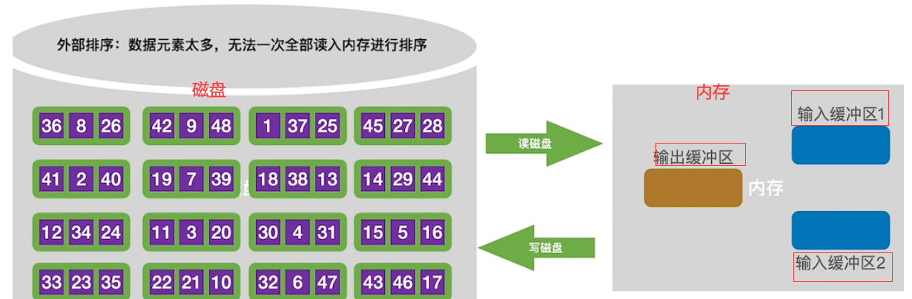

1. 读写磁盘时间：

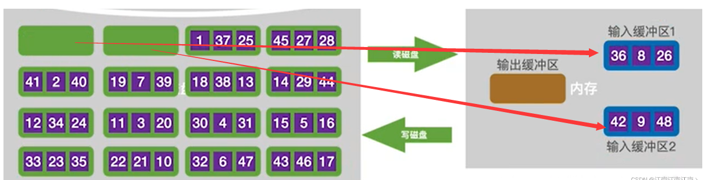

2. 内部排序时间：

将输入缓冲区1、2分别进行内部排序

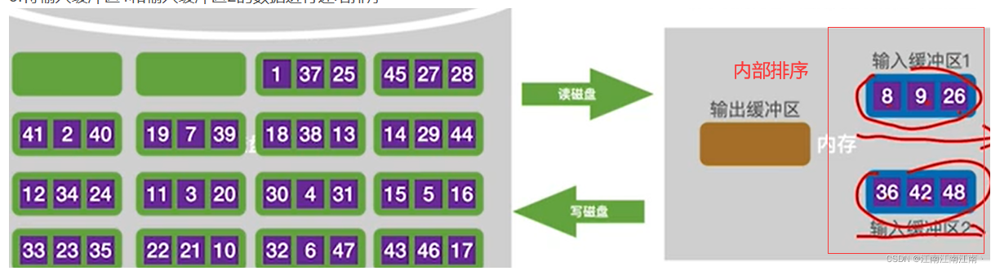

3. 内部归并时间：

将输入缓冲区1 2的数据通过输出缓冲区逐一写入外存

此时也可以得知：每将整个数据归并一趟，需要读写磁盘中整个数据一次

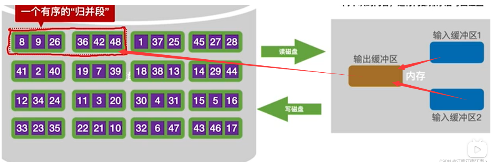

之后的故事：

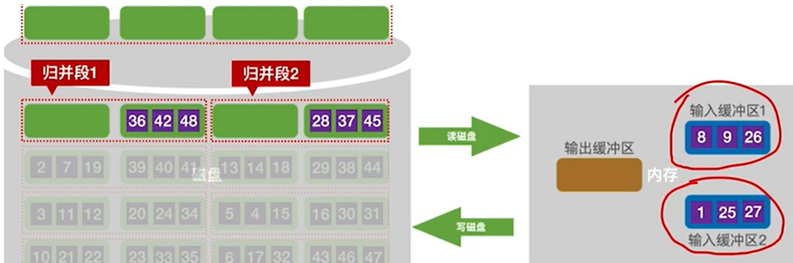

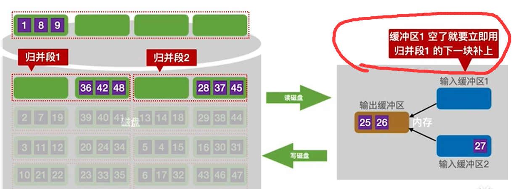

经分析，尤其要注意：**当输入缓冲区空了要立即从磁盘中读出数据**，之后才能将输出缓冲区中的数据写入磁盘

**时间开销=磁盘读写时间+内部排序时间+内部归并时间**

### 多路归并

**时间开销=磁盘读写时间+内部排序时间+内部归并时间**

注意是磁盘读写时间，又可知每归并一趟，就需读写磁盘一次

所以，减小归并趟数重中之重

>已知生成初始片段r个， 进行k路归并
>
>叶子节点为r个的k叉树， 高度大概 k^h=r  h=logk^r

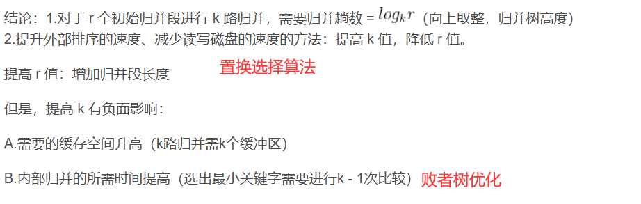

显然，进行多路归并能有效减少归并趟数

**然而，每次选出最小的元素需要更多的比较次数**

显然，可以用一个小根堆来优化这里每次的比较次数

### 败者树

>败者树用来减少关键字的比较次数。

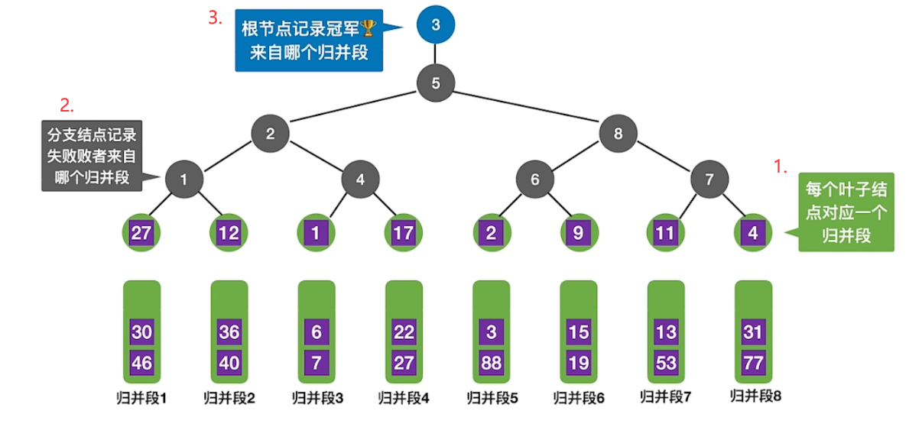

第一次构造败者树需要k-1次比较，

之后，比如下一步，6只需要比较 log2k次，在跟归并段5的比较过程中让归并段5夺冠

### 置换选择算法

> 让初始归并段r更少， 即使归并段更长

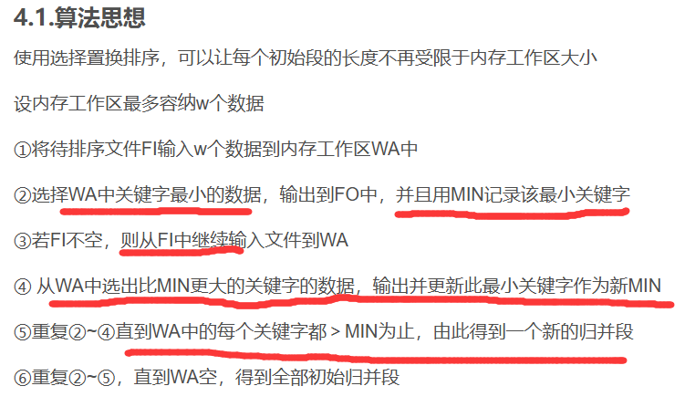

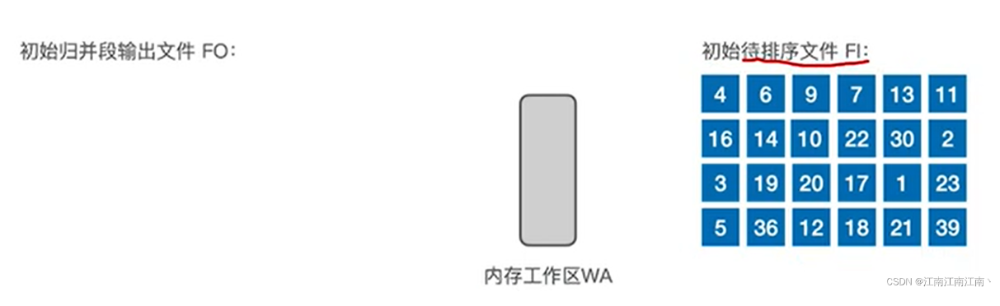

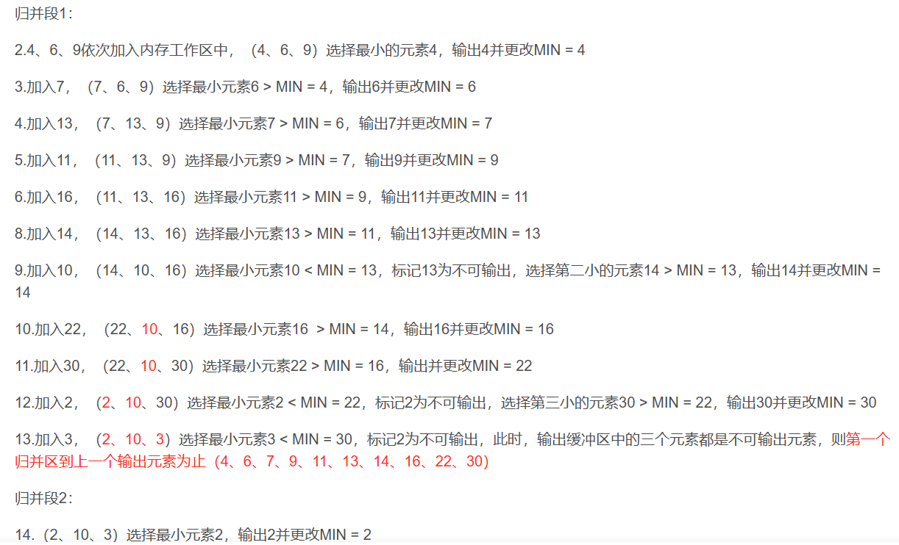

### 最佳归并树

>对于参差不齐的初始归并段，归并顺序也很重要

>对于两个长度分别为l1 、l2的数据做二路归并，
>
>显然要读磁盘l1+l2次，写磁盘l1+l2次
>
>如果是三个长度分别为3、4、5的归并数据段呢？
>
>先3、4再5、（3+4）则总次数为 (3+4)+(5+3+4)
>
>而先4、5再3、（4+5）总次数为： (4+5)+(3+4+5)
>
>也就是说 对于参差不齐的归并段，归并过程中最佳的磁盘IO次数是一颗哈夫曼树

值得注意的是，**k叉归并的最佳归并树一定是严格k叉树，所以很可能叶子结点的个数不满足构造严格k叉归并树**，这时候需要补充**虚段**

(权值为0的叶子结点，然后将这些权值为0的结点作为最初始的构造结点.）

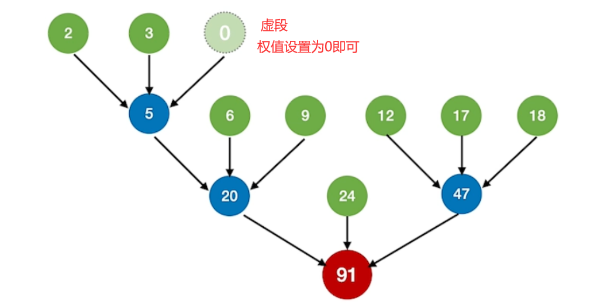

### 结论

**至此，对于以后的外部排序，**

1. **首先，通过置换选择算法，获得尽可能小的归并段数量**，尽可能长的归并段段长r

2. **接着，构造最佳归并树，即哈夫曼树，确定最佳归并顺序**
3. **最后，构造败者树，进行k路归并**

### 常见面试问题（待补充）

